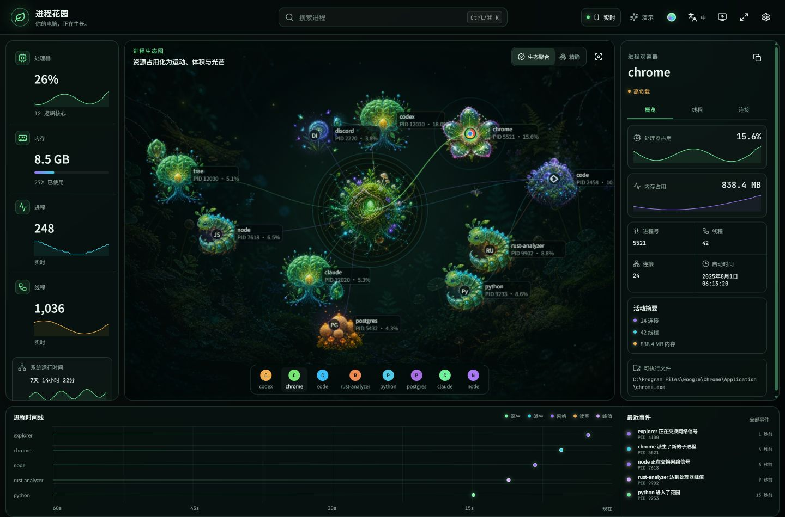
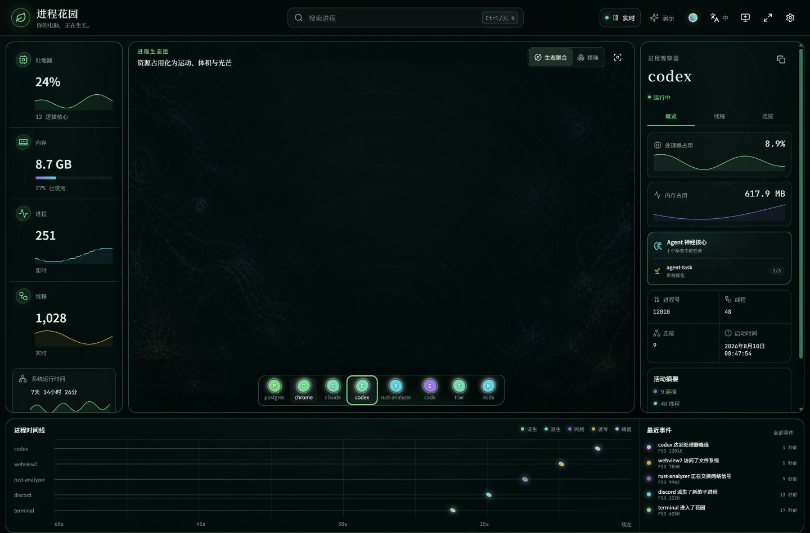

# Process Garden

> Your computer is alive. / 你的电脑，正在生长。

Process Garden turns local CPU, memory, process and parent–child activity into a living digital ecosystem. It is a bilingual, local-first Windows desktop application with seven built-in themes, fullscreen presentation and a true behind-the-icons wallpaper mode. Released under the [MIT License](LICENSE).



## Windows release

The current version is available as source; follow the build instructions below to run it on Windows. Published installers, when available, appear on [GitHub Releases](https://github.com/lllleolin-max/Process-Garden/releases). The files described in [release/README.md](release/README.md) are historical local build records, not downloads of the current source.

## Why it is different

- **Real organisms, real processes** — size follows memory, motion follows CPU, branches follow parent PID, and births/exits become visible lifecycle events.
- **Local power readings** — live watts and a recent trend appear in the sidebar and wallpaper HUD. On supported Windows hardware, the app reads battery discharge or the Intel driver's package energy counter. Each reading names its scope; package power is not total computer or wall-socket consumption. See [power sources and limitations](docs/power.md).
- **Seven built-in themes** — Garden, Deep Sea Cthulhu, Neon Matrix, Crimson Gaze, Sacred Angel, Olympus and Minimal share process semantics while providing their own visual presentation. The Garden renderer includes 16 stable process specimens, four habitat types and four animated pollinators.
- **Application-aware ecology** — browsers, editors, runtimes, databases, containers, media, system work and heavy compute resolve to stable organism families. Any application can be pinned to a user-selected family in Settings.
- **True application identity** — every desktop process uses the icon embedded in its own executable across the Canvas, process dock and Inspector. A bundled offline catalog covers common demo applications; initials are the final fallback.
- **Refresh-matched motion** — global 30/60/120 Hz animation targets stay synchronized to the display while system sampling remains independently configurable.
- **Flash-free sampling** — collector updates feed a persistent Canvas scene; CPU, memory, position and size interpolate between samples. Garden organisms grow/dissolve, while Eldritch births are expelled in slime and exits are spiralled into the central core's generated-art maw before a snapping bite and recoil.
- **Agent lifecycle** — Claude, Codex, Trae, WorkBuddy and compatible Agent processes become theme-specific neural cores; direct child task processes grow around them as three-stage embryos.
- **A real ambient mode** — on Windows the app can attach to the WorkerW wallpaper layer. A bilingual tray menu always provides a safe way back.
- **Theme authoring** — describe a theme, copy AI artwork prompts, upload custom PNG backgrounds and sprites, preview, save and export the complete theme. Partial replacements inherit built-in artwork; images stay local and survive restarts. `.pgtheme` files are validated ZIP containers and cannot execute code.
- **English + 简体中文** — instant, persistent switching with fully bundled offline fonts, including complete Noto SC coverage.
- **Private by design** — no account, telemetry, cloud, remote fonts, process memory reading or file-content reading.



## Quick start

Requirements: Node.js 24+, Rust 1.93+, WebView2, and a Windows C/C++ toolchain. The checked-in PowerShell launcher also handles GNU Rust builds from Unicode project paths.

```powershell
npm ci
npm run dev          # browser demo
npm run tauri:dev    # native live collector
```

The browser build deliberately starts in Demo mode. The Tauri desktop build starts with live local data; Demo mode remains available in Settings and from the top bar.

## Build and verify

```powershell
npm run verify
npm run tauri:build
```

`npm run verify` runs TypeScript checks, Vitest and the production frontend build. Native Rust tests can be run from `src-tauri` with `cargo test --lib`; the Windows release workflow runs both layers before packaging.

## Controls

- `Ctrl/⌘ K` focuses process search.
- Theme swatch switches or adds themes without reloading.
- Settings → Garden can pin an application to a visual family or return it to automatic classification.
- Settings → Display selects a global 30/60/120 Hz animation target; the actual rate never exceeds the monitor's refresh ceiling.
- `中 / EN` switches language immediately.
- Monitor button enters or exits wallpaper mode.
- Expand button toggles fullscreen.
- `Esc` closes the active dialog or returns from fullscreen/wallpaper.
- Drag an organism onto the central core to review ending its process; release outside or press `Esc` to cancel. With the Canvas focused, `Delete` reviews the selected process. Confirmation ends only that PID, not its children. Demo mode removes only a simulated organism. Windows checks process identity and refuses protected processes; forced termination can lose unsaved work.
- The system tray can always restore or quit a wallpaper session.

## Architecture

```text
sysinfo + Windows Toolhelp + Shell icon extraction
              ↓
    versioned SystemSnapshot
              ↓
  Zustand history + delta events
              ↓
React shell ── Canvas ecology ── Inspector/Timeline
      ↓               ↓
theme/i18n       WorkerW adapter
```

The Rust collector keeps one long-lived `sysinfo::System` instance, refreshes it incrementally, and adds a single Windows thread snapshot per sample. Executable icons are extracted once and cached by path. Rendering cadence is independent from collection cadence: one persistent render loop reconciles samples by PID, smooths resource and layout targets, and retains exiting organisms for a short dissolution. Wallpaper mode lowers collection and visual complexity while preserving the selected animation target.

## Themes and fonts

The v1 theme contract is documented in [docs/themes.md](docs/themes.md), with a practical authoring guide in [docs/theme-authoring.md](docs/theme-authoring.md). Font families, roles, sources and licenses are inventoried in [docs/fonts.md](docs/fonts.md). All font files are bundled; the app never contacts a font CDN.

## Privacy

See [docs/privacy.md](docs/privacy.md). Process Garden reads process metadata and resource counters only. It does not read process memory, file contents, keystrokes, browser history, or per-process network payloads. No data leaves the machine.

## Project docs

- [Reference analysis](docs/reference-analysis.md)
- [Architecture](docs/architecture.md)
- [Display modes](docs/modes.md)
- [Theme contract](docs/themes.md)
- [Theme authoring](docs/theme-authoring.md)
- [Localization](docs/localization.md)
- [Fonts](docs/fonts.md)
- [Performance](docs/performance.md)
- [Decisions](docs/decisions.md)
- [Generated assets](docs/assets.md)
- [Design QA](design/qa.md)
- [Open-source research](design/research.md)

## License

Application code is MIT licensed. Bundled fonts use SIL Open Font License 1.1. Dependency and asset notices are in [THIRD_PARTY_NOTICES.md](THIRD_PARTY_NOTICES.md).
