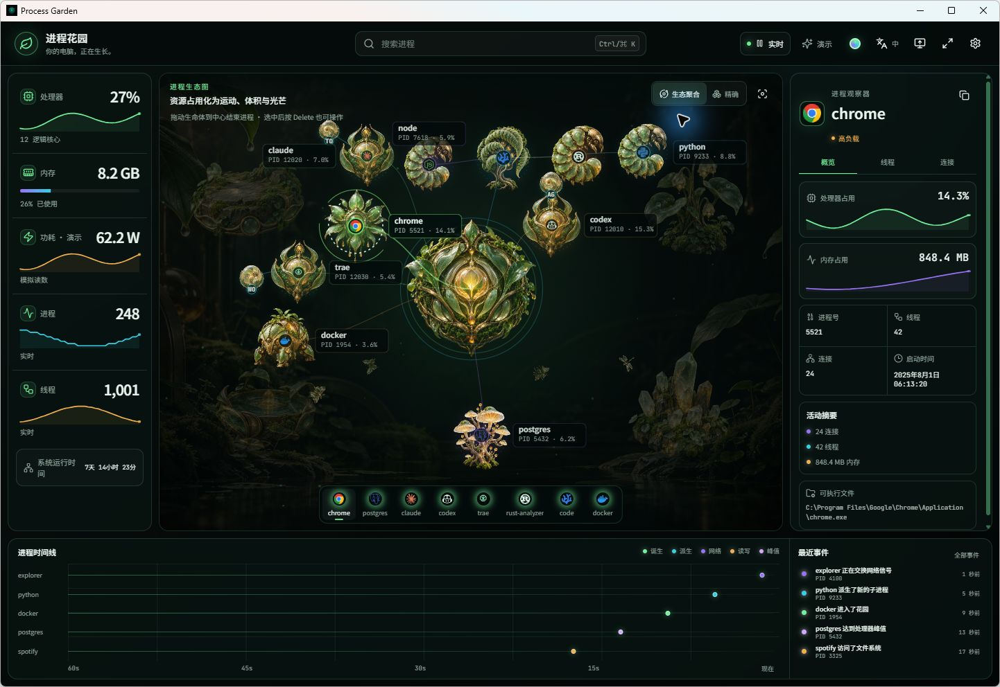
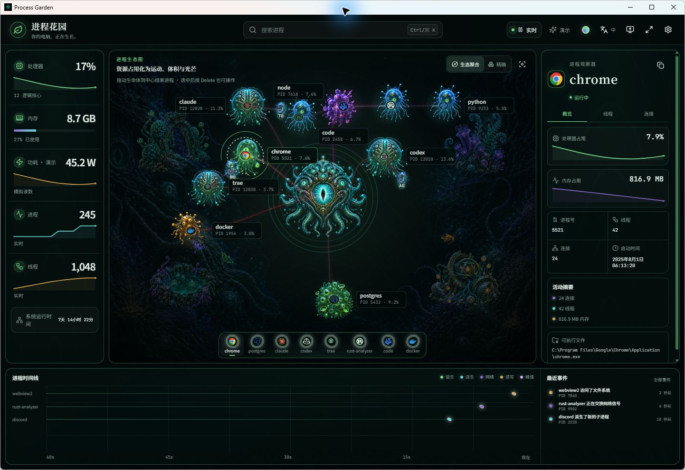
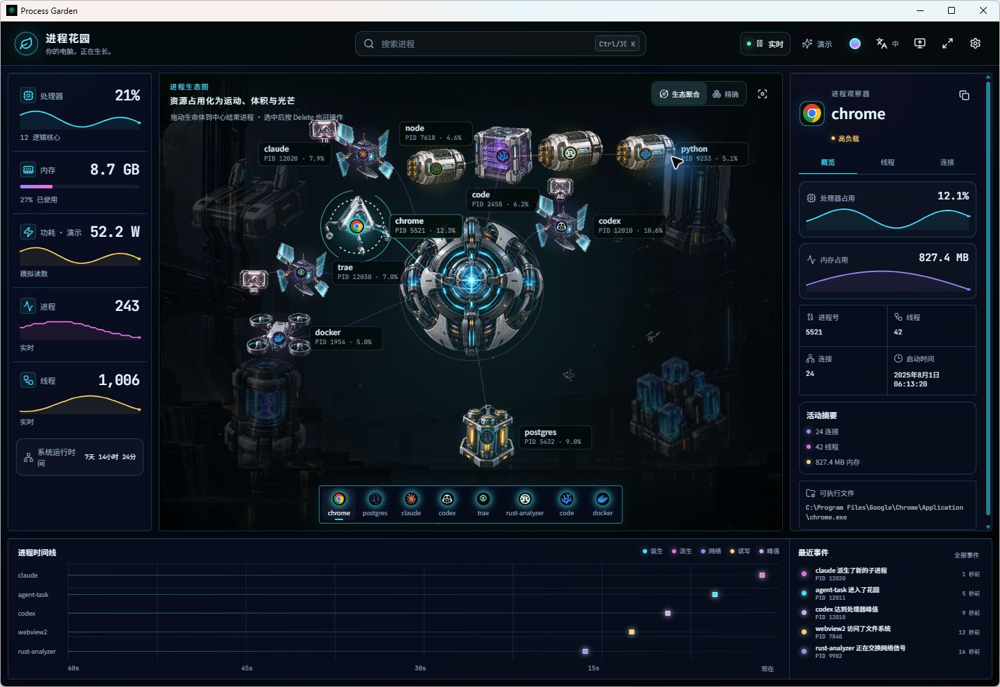
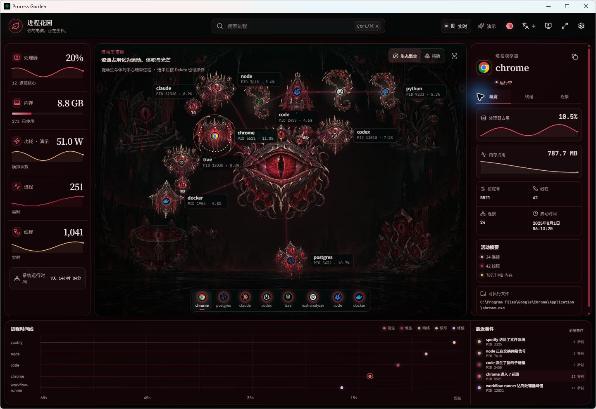
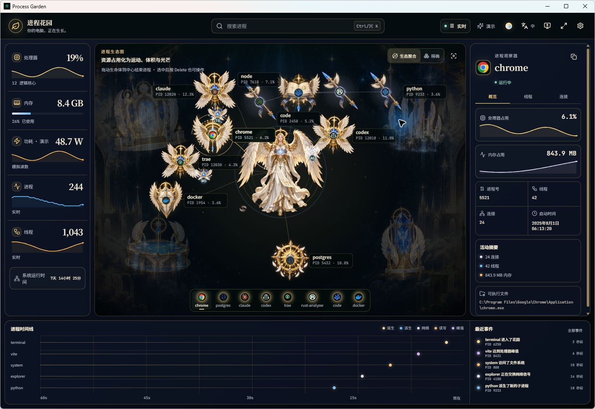
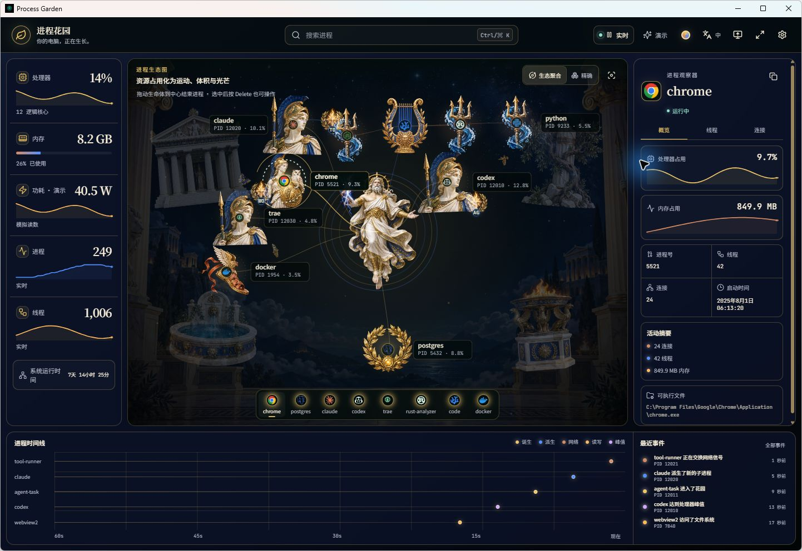

# Process Garden

> Your computer is alive. / 你的电脑，正在生长。

Process Garden turns local CPU, memory, process and parent–child activity into a living digital ecosystem. It is a bilingual, local-first desktop application for Windows and macOS with seven built-in themes and fullscreen presentation. Windows also supports a true behind-the-icons wallpaper mode. Released under the [MIT License](LICENSE).

把 CPU、内存和进程活动变成可观察的桌面生态。适合希望直观看到电脑负载、识别活跃进程或使用动态桌面的用户；精确诊断仍应结合系统任务管理器或专用分析工具。

**[Download / 下载安装](#download--下载安装)** · [Run from source](#quick-start) · [Controls](#controls) · [Privacy](#privacy)



## Theme gallery / 主题实机演示

<details>
<summary>View six running-app screenshots / 展开六个主题截图</summary>

Six screenshots of the running Windows desktop app, built from the current source. They use the app's built-in **Demo** data for comparison; these are actual rendered interfaces, not concept images. Click an image to view it at full size.

以下为 Windows 桌面应用实际运行截图，统一使用内置**演示数据**展示六个主题。点击图片可查看原图。

### Garden / 生态花园

Living moss, luminous roots and miniature botanical organisms.


### Deep Sea Cthulhu / 深海克苏鲁

A blue abyssal core with cyan light and vivid purple, green and amber creatures.



### Neon Matrix / 霓虹矩阵

Neon circuitry, mechanical organisms and a cybernetic core.



### Crimson Gaze / 猩红凝视

A dark crimson eye surrounded by an uncanny living ecosystem.



### Sacred Angel / 神圣天使

Luminous wings and celestial forms around a sacred central figure.



### Olympus / 奥林匹斯

Classical divine imagery, golden accents and an Olympian atmosphere.



</details>

## Download / 下载安装

**[Process Garden v0.1.0](https://github.com/lllleolin-max/Process-Garden/releases/tag/v0.1.0)** is available for Windows and macOS.

| Platform | Installer | Notes |
| --- | --- | --- |
| Windows x64 | [EXE installer](https://github.com/lllleolin-max/Process-Garden/releases/download/v0.1.0/Process-Garden_0.1.0_x64-setup.exe) (recommended) · [MSI installer](https://github.com/lllleolin-max/Process-Garden/releases/download/v0.1.0/Process-Garden_0.1.0_x64_en-US.msi) | WebView2 required; the installer can install it if missing. |
| macOS 11+ | [Universal DMG](https://github.com/lllleolin-max/Process-Garden/releases/download/v0.1.0/Process-Garden_0.1.0_universal.dmg) | Supports Apple Silicon and Intel. Drag the app to Applications. |

[SHA-256 checksums](https://github.com/lllleolin-max/Process-Garden/releases/download/v0.1.0/SHA256SUMS.txt) accompany the installers. Windows packages are unsigned; macOS uses an ad-hoc signature and is not Apple-notarized, so the operating system may warn or block opening. See [release notes and platform limitations](release/RELEASE-NOTES.md).

macOS is an initial preview: live CPU, memory and processes, all themes, fullscreen and theme packages are supported. Native process termination, desktop wallpaper attachment, hardware power readings and native executable icons are Windows-only; macOS thread counts are currently unavailable and displayed as zero. The historical local builds documented in [release/README.md](release/README.md) predate this release.

After installing, open the app to see live local processes. Select an organism to inspect it, switch themes from the top bar, or enable **Demo** in Settings to explore simulated data. Missing or unavailable power means there is no current usable measurement: hardware may be unsupported, the collector may be waiting or have failed, or a sample may be stale. It is not a zero-watt measurement. Use the tray menu to return from wallpaper mode.

安装后先查看实时进程，再尝试切换主题和选中生物查看详情。演示模式使用模拟数据；功耗读数是否可用取决于硬件。仅下载安装包无需 Node.js 或 Rust。

## Why it is different

- **Real organisms, real processes** — size follows memory, motion follows CPU, branches follow parent PID, and births/exits become visible lifecycle events.
- **Local power readings** — live watts and a recent trend appear in the sidebar and wallpaper HUD. On supported Windows hardware, the app reads battery discharge or the Intel driver's package energy counter. Each reading names its scope; package power is not total computer or wall-socket consumption. See [power sources and limitations](docs/power.md).
- **Seven built-in themes** — Garden, Deep Sea Cthulhu, Neon Matrix, Crimson Gaze, Sacred Angel, Olympus and Minimal share process semantics while providing their own visual presentation. The Garden renderer includes 16 stable process specimens, four habitat types and four animated pollinators.
- **Application-aware ecology** — browsers, editors, runtimes, databases, containers, media, system work and heavy compute resolve to stable organism families. Any application can be pinned to a user-selected family in Settings.
- **True application identity on Windows** — desktop processes use the icon embedded in their executable across the Canvas, process dock and Inspector. A bundled offline catalog covers common applications and other platforms; initials are the final fallback.
- **Refresh-matched motion** — global 30/60/120 Hz animation targets stay synchronized to the display while system sampling remains independently configurable.
- **Flash-free sampling** — collector updates feed a persistent Canvas scene; CPU, memory, position and size interpolate between samples. Garden organisms grow/dissolve, while Eldritch births are expelled in slime and exits are spiralled into the central core's generated-art maw before a snapping bite and recoil.
- **Agent lifecycle** — Claude, Codex, Trae, WorkBuddy and compatible Agent processes become theme-specific neural cores; direct child task processes grow around them as three-stage embryos.
- **A real ambient mode** — on Windows the app can attach to the WorkerW wallpaper layer. A bilingual tray menu always provides a safe way back.
- **Theme authoring** — describe a theme, copy AI artwork prompts, upload custom PNG backgrounds and sprites, preview, save and export the complete theme. Partial replacements inherit built-in artwork; images stay local and survive restarts. `.pgtheme` files are validated ZIP containers and cannot execute code.
- **English + 简体中文** — instant, persistent switching with fully bundled offline fonts, including complete Noto SC coverage.
- **Private by design** — no account, telemetry, cloud, remote fonts, process memory reading or file-content reading.

## Quick start

For the browser demo, install Node.js 24+ and Git. Clone the repository and run:

```powershell
git clone https://github.com/lllleolin-max/Process-Garden.git
cd Process-Garden
npm ci
npm run dev          # browser demo
```

Open the local URL printed by Vite. This preview uses simulated processes and does not collect live system data. Stop it with `Ctrl+C`.

For native Windows development, also install Rust 1.93+, WebView2 and a Windows C/C++ toolchain, then run `npm run tauri:dev`. The checked-in PowerShell launcher also handles GNU Rust builds from Unicode project paths.

On macOS, install Node.js, Rust and Xcode Command Line Tools, then use the cross-platform Tauri CLI directly:

```sh
npm ci
npx tauri dev
npx tauri build --bundles dmg
```

To build a universal Mac app, install both Rust targets with `rustup target add aarch64-apple-darwin x86_64-apple-darwin`, then run `npx tauri build --target universal-apple-darwin --bundles dmg`.

The browser build deliberately starts in Demo mode. The Tauri desktop build starts with live local data; Demo mode remains available in Settings and from the top bar.

## Build and verify

```powershell
npm run verify
npm run tauri:build
```

`npm run verify` runs TypeScript checks, Vitest and the production frontend build. Native Rust tests can be run from `src-tauri` with `cargo test --lib`; the Windows release workflow runs both layers before packaging.

## Controls

- `Ctrl/⌘ K` focuses process search.
- Theme swatch switches or adds themes without reloading.
- Settings → Garden can pin an application to a visual family or return it to automatic classification.
- Settings → Display selects a global 30/60/120 Hz animation target; the actual rate never exceeds the monitor's refresh ceiling.
- `中 / EN` switches language immediately.
- Monitor button enters or exits wallpaper mode.
- Expand button toggles fullscreen.
- `Esc` closes the active dialog or returns from fullscreen/wallpaper.
- Drag an organism onto the central core to review ending its process; release outside or press `Esc` to cancel. With the Canvas focused, `Delete` reviews the selected process. Confirmation ends only that PID, not its children. Demo mode removes only a simulated organism. Windows checks process identity and refuses protected processes; forced termination can lose unsaved work.
- The system tray can always restore or quit a wallpaper session.

## Architecture

```text
sysinfo + Windows Toolhelp + Shell icon extraction
              ↓
    versioned SystemSnapshot
              ↓
  Zustand history + delta events
              ↓
React shell ── Canvas ecology ── Inspector/Timeline
      ↓               ↓
theme/i18n       WorkerW adapter
```

The Rust collector keeps one long-lived `sysinfo::System` instance, refreshes it incrementally, and adds a single Windows thread snapshot per sample. Executable icons are extracted once and cached by path. Rendering cadence is independent from collection cadence: one persistent render loop reconciles samples by PID, smooths resource and layout targets, and retains exiting organisms for a short dissolution. Wallpaper mode lowers collection and visual complexity while preserving the selected animation target.

## Themes and fonts

The v1 theme contract is documented in [docs/themes.md](docs/themes.md), with a practical authoring guide in [docs/theme-authoring.md](docs/theme-authoring.md). Font families, roles, sources and licenses are inventoried in [docs/fonts.md](docs/fonts.md). All font files are bundled; the app never contacts a font CDN.

## Privacy

See [docs/privacy.md](docs/privacy.md). Process Garden reads process metadata and resource counters only. It does not read process memory, file contents, keystrokes, browser history, or per-process network payloads. No data leaves the machine.

## Project docs

- [Reference analysis](docs/reference-analysis.md)
- [Architecture](docs/architecture.md)
- [Display modes](docs/modes.md)
- [Theme contract](docs/themes.md)
- [Theme authoring](docs/theme-authoring.md)
- [Localization](docs/localization.md)
- [Fonts](docs/fonts.md)
- [Performance](docs/performance.md)
- [Decisions](docs/decisions.md)
- [Generated assets](docs/assets.md)
- [Design QA](design/qa.md)
- [Open-source research](design/research.md)

## License

Application code is MIT licensed. Bundled fonts use SIL Open Font License 1.1. Dependency and asset notices are in [THIRD_PARTY_NOTICES.md](THIRD_PARTY_NOTICES.md).
